# MDC_cut: An ARPES data analysis tool

This application is specifically designed to process data produced by [**Spectrium**](https://prevac.pl/produkt/spectrium/), a software product of [**PREVAC sp. z o.o.**](https://prevac.pl/)

[**MDC_cut.py**](MDC_cut.py) provides a user-friendly GUI for handling datasets acquired with the [**PREVAC EA15**](https://prevac.eu/product/hemispherical-energy-analyser-ea15/) hemispherical electron energy analyzer.

See [`MDC_cut_UserManual.pdf`](MDC_cut_UserManual.pdf) for detailed instructions.
The user manual is currently out of date. For the latest changes and new features, refer to the release notes.

- **One Click to Go**: Launch instantly — no setup, no friction.
- **Intuitive Interface**: Clean, user-friendly design with zero learning curve.
- **Comprehensive Toolkit**: All-in-one solution for ARPES data visualization and analysis.
    - **Sample Offset Fitter**: Precisely calibrate sample orientation.
    - **k-plane Conversion**: Transform raw data into momentum space seamlessly.
    - **Volume Viewer**: Explore and slice 3D k-space data with ease.
    - **MDC Fitter**: Analyze momentum distribution curves efficiently.
    - **Spectrogram Tool**: Generate and select spectrograms from your data.
    - **Versatile Export Options**: Export data in graph(.png, .jpg...), HDF5, CasaXPS (.vms), and OriginPro (.opj/.opju) formats.

## Feature Highlights

<video src="https://github.com/user-attachments/assets/530e1fe7-68b9-4f6c-bbc3-5c98394d988d" controls loop autoplay muted width="100%"></video>
<video src="https://github.com/user-attachments/assets/bb8f29a5-086e-418b-826f-9aedcbcf0fe6" controls loop autoplay muted width="100%"></video>

## Contents
- [**Installation**](#installation)
  - [**What will `MDC_cut.py` do?**](#what-will-mdc_cutpy-do)
- [**Basic Knowledge Overview**](#basic-knowledge-overview)
  - [**Geometry Definition**](#geometry-definition)
  - [**Coordinate Transformation: Real to Reciprocal Space**](#coordinate-transformation-real-to-reciprocal-space)
- [**Work Flow**](#work-flow)
  - [**E-Angle to E-k Conversion**](#e-angle-to-e-k-conversion)
- [**Requirements**](#requirements)
- [**License**](#license)
- [**Snapshots**](#snapshots)

## Installation
> [!WARNING]
> It is highly recommended to run `MDC_cut.py` in a virtual environment to avoid conflicts with existing packages in your main Python environment.
> 
> `MDC_cut.py` will attempt to install the required dependencies automatically by **pip** if they are not already present.
>
> Make sure you have an environment with **Python 3.12 or above**.
- Please download [`MDC_cut.py`](MDC_cut.py) and place it in the directory you want.
- Create a virtual environment (e.g., via ) with the required Python version to avoid changing your main environment, then run `MDC_cut.py` to automatically install the dependencies.
- If you don’t mind the environment, execute `MDC_cut.py` and check that it automatically installs the required dependencies.

### What will `MDC_cut.py` do?
1. Download the required files from this repository and place them into the working PATH of `MDC_cut.py`.
2. Try to use the pip installer to install the required python packages.
3. Start the GUI.

## Basic Knowledge Overview
The PREVAC EA15 analyzer can operate in two different lens modes: **Angular LensMode** and **Transmission LensMode**.

- In **Angular LensMode**, the analyzer resolves the emission angles of the photoelectrons, allowing for the mapping of electronic band structures in momentum space (k-space).
- In **Transmission LensMode**, the analyzer focuses on the spatial distribution of photoelectrons, which is useful for imaging applications.

The choice of lens mode affects how the data is interpreted and analyzed, particularly in relation to the geometry of the sample manipulator.

### Geometry Definition
The geometry of the data is defined by the angles or positions of the sample manipulator motors.
The following table illustrates the relationship between motor positions and the corresponding energy and angles resolved by the EA15 analyzer.
> [!NOTE]
> The values shown in the images below are for illustration purposes only and do not represent actual measurements.
> The actual positions and angles of the motors might not be exactly the same as those depicted.
>
> For example, R1=-31° corresponds to $\psi$=0° and R2=85° corresponds to $\phi$=0° in the **Spectrium** software.
>
> However, users might not suffer from this offset since they can always calibrate the offset angle in the **k-plane** tool.
> Additionally, there would be no difference in the k-space conversion as long as the relative angles are correct.

|E (Kinetic Energy)|$\theta$ (Angle resolved by EA15 lens)|
|:---:|:---:|
||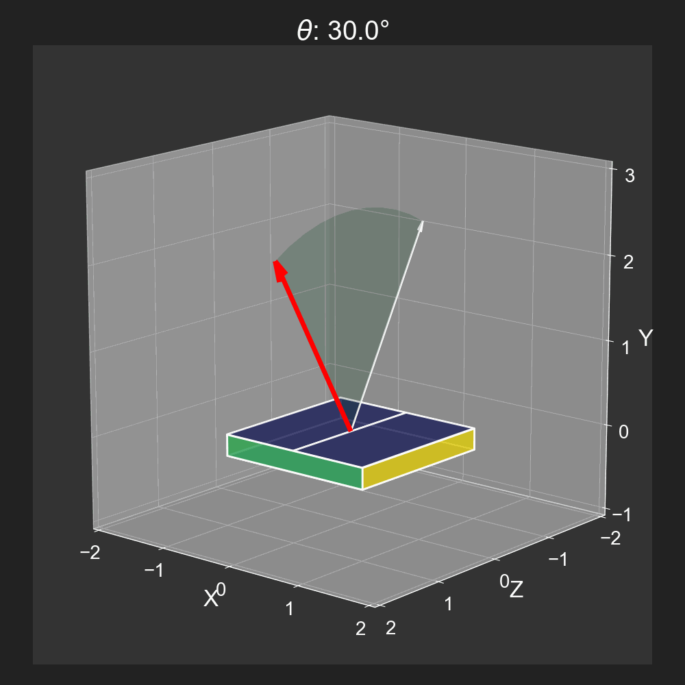|

|$\phi$ (Rotation around Y-axis, **R2** Motor)|$\psi$ (Tilt around Z-axis, **R1** Motor)|
|:---:|:---:|
|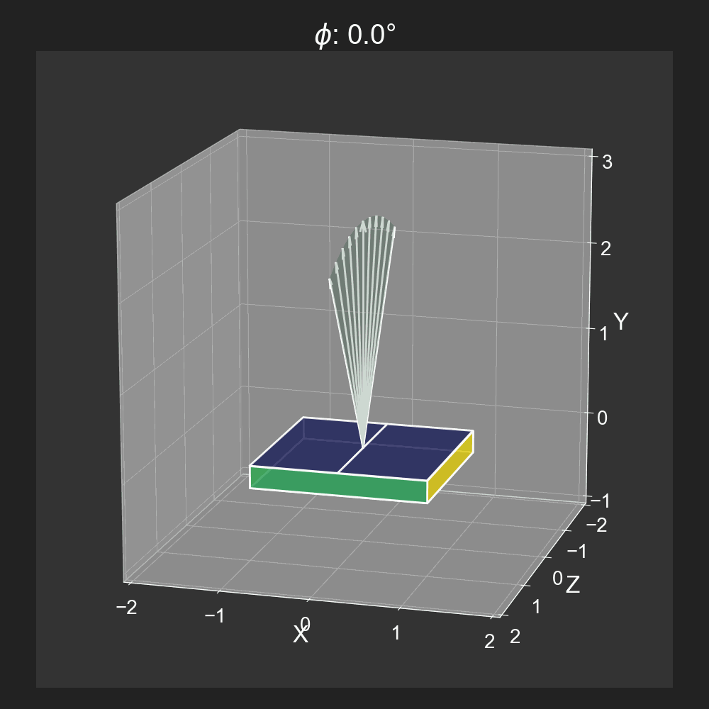|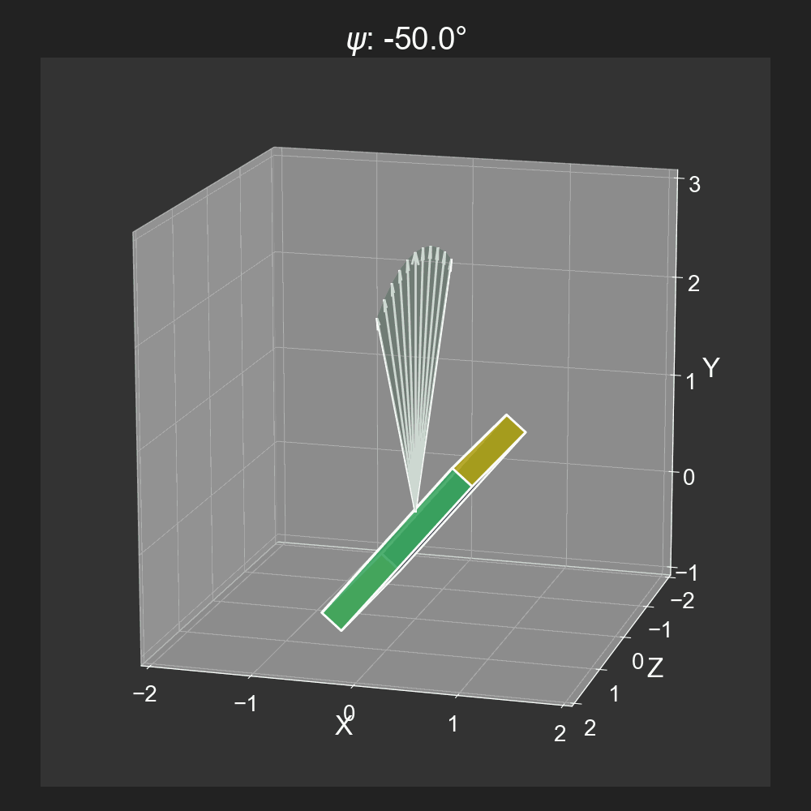|

### Coordinate Transformation: Real to Reciprocal Space
The conversion from real space to reciprocal space (k-space) is essential for interpreting ARPES data.
Let's see a basic case considering only $\theta$ and $\psi$ angles.
The momentum components $k_x$ and $k_y$ can be calculated using the following equations:

$k_x = \frac{\sqrt{2mE}}{\hbar} \cos(\theta) \sin(\psi)$

$k_y = \frac{\sqrt{2mE}}{\hbar} \sin(\theta)$

Obviously, a larger kinetic energy E will lead to a larger momentum k.
The angles $\theta$ and $\psi$ determine the direction of the momentum vector in k-space.
By varying these angles during the measurement, one can map out the electronic band structure of the material under study.

The following table illustrates how changes in kinetic energy and angles affect the momentum components in k-space.
The color change in viridis colormap indicates the variation in Kinetic Energy E for better visualization,
and the two surfaces represent the $E-kx-ky$ map corresponding to $\psi=0°$ and $\psi=50°$, respectively.

|Wave Vector in k-space|Corresponding $E-k_x-k_y$ map|
|:---:|:---:|
|||

> [!NOTE]
> The angular cooridnates ($\theta$, $\phi$, $\psi$) stay the same in both real(x, y, z) and reciprocal($k_x$, $k_y$, $k_\perp$) space.

Now you should have a basic understanding of how the geometry of the sample manipulator relates to the angles and positions used in ARPES measurements with the PREVAC EA15 analyzer.
Let's consider if we want to obtain a $E-k_x-k_y$ map cut through a specific path in k-space,
which is usually required for further analysis like MDC fitting.

The following table illustrates the $E-k_y$ cut at $k_x=1.65$ as an example.
The blue line represents a hexagonal first Brillouin zone boundary as a reference.
The red mesh grid indicates the desired $E-k_y$ cut.
The white mesh grid indicates the $E-k_x-k_y$ map acquired at a fixed $\psi$ angle.

|||
|:---:|:---:|

It's not difficult to see that 
we cannot obtain an orthogonal $E-k_x-k_y$ map with only one spectrum acquired at a fixed $\psi$ angle.
To get an orthogonal k-space map that we can do further analysis on, 
we need to vary the $\psi$ angle (R1 motor) during the measurements 
or even change the $\phi$ angle (R2 motor) as well to cover the desired k-space region.

## Work Flow
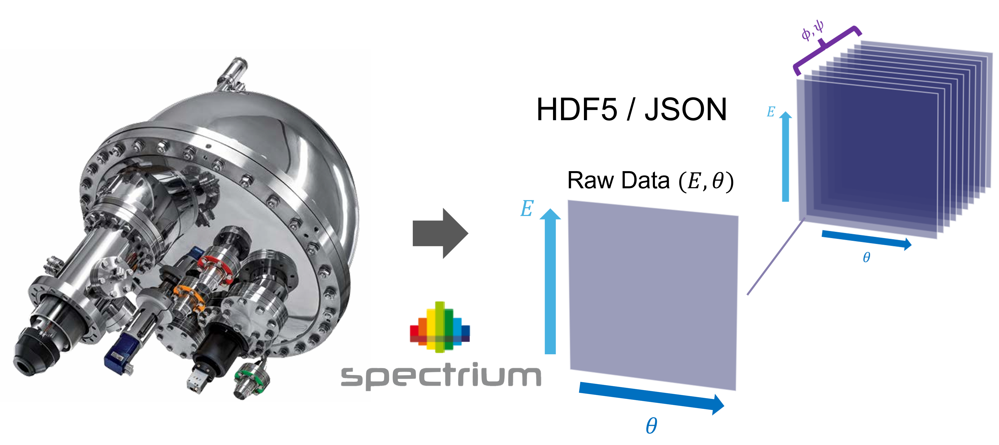
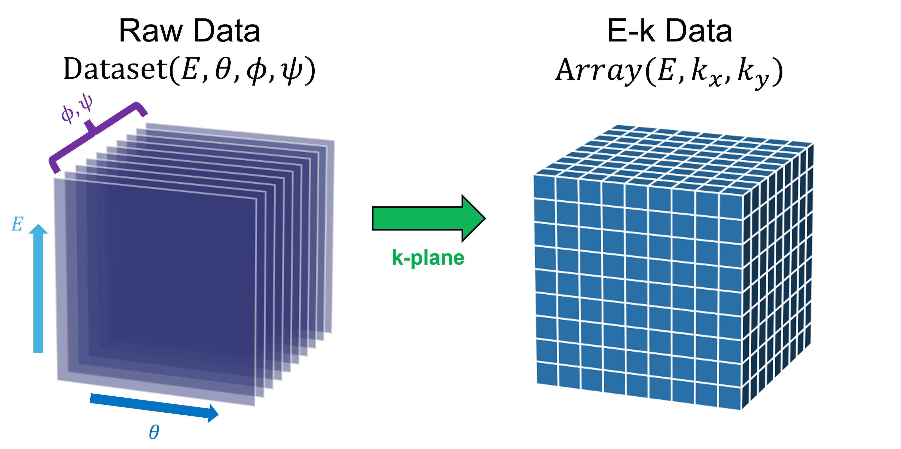
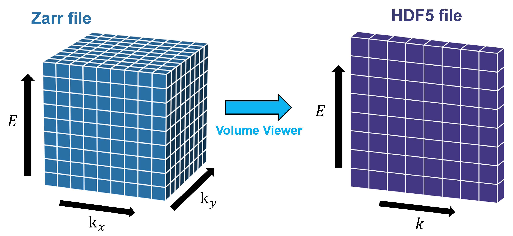

> [!IMPORTANT]
> Always specify the file name with clear geometric suffixes like
>> **Name1_R1_18_R2_85.h5**, **Name2_r1_12_r2_45.h5**
>> 
> for Angular LensMode
>> 
> or
>> **Name3_X_12_Z_45.h5**, **Name4_x_11_z_48.h5**
>> 
> for Transmission LensMode
>> 
> to well define the geometry of the spectum acquired.

### E-Angle to E-k Conversion
The application will parse the file name to extract the geometry information. R1 and R2 represent the motor of the sample manipulator, while the numbers denote the angles(in degrees) or position(in millimeters) of the respective motors.

Let's say we have some ARPES raw data files (`.h5`/`.json` format) from the PREVAC EA15 analyzer.

The typical workflow would be:
1. Launch `MDC_cut.py`.
2. Use the GUI to load your raw data files.
3. Open **k-plane** tool in **Batch Master** to convert raw data into k-space.
> [!NOTE]
> The **Batch Master** button only appears when loading multiple files.
4. Set the calibration parameters(Offset angle) in the **k-plane** tool and export the data.
> [!NOTE]
> **Sample Offset Fitter** can help you find the offset angle with ease.
5. After exporting, you can visualize the data in the **Volume Viewer** tool. It allows you to slice through the 3D k-space data export the desired 2D cuts in HDF5 format.
6. Further analysis like MDC fitting can be performed in the **MDC Fitter** tool by loading the exported 2D cuts back into `MDC_cut.py` using the **Load Raw Data** button.
>[!TIP]
> Many tools in `MDC_cut.py` have HOTKEY bindings for quick access. Try **Enter**, **Up Arrow**, **Down Arrow**, **Left Arrow**, **Right Arrow**, and **Scroll Wheel** for navigation, confirmation, and adjustments.

In addition to the steps mentioned above, `MDC_cut.py` provides a variety of tools for data visualization, exporting to [**CasaXPS**](https://www.casaxps.com/)(.vms), and generating [**OriginPro**](https://www.originlab.com/) projects(.opj/.opju). Explore the GUI to discover more features!

## Requirements
You don't need to manually install the dependencies. `MDC_cut.py` will automatically install them via pip if they are not already present in your environment.
The following are the tested Python versions and their corresponding package versions:

|||
|:---:|:---:|
|||
|||
|||
|||
|||
|||
|||
|||
|||
|||
|||
|||
|||
|||
|||
|||
|||

The only difference between Python 3.12.x and 3.13.x environments is the numpy and opencv-python versions due to pip version compatibility.
You can find the full list of required packages in the beginning section of `MDC_cut.py`.(**REQUIREMENTS**)
The highest tested Python version is **3.13.5**.

## License
This project is licensed under the MIT License - see the [LICENSE](LICENSE) file for details.
Note that those third-party libraries used in this project may have their own licenses.

## Snapshots

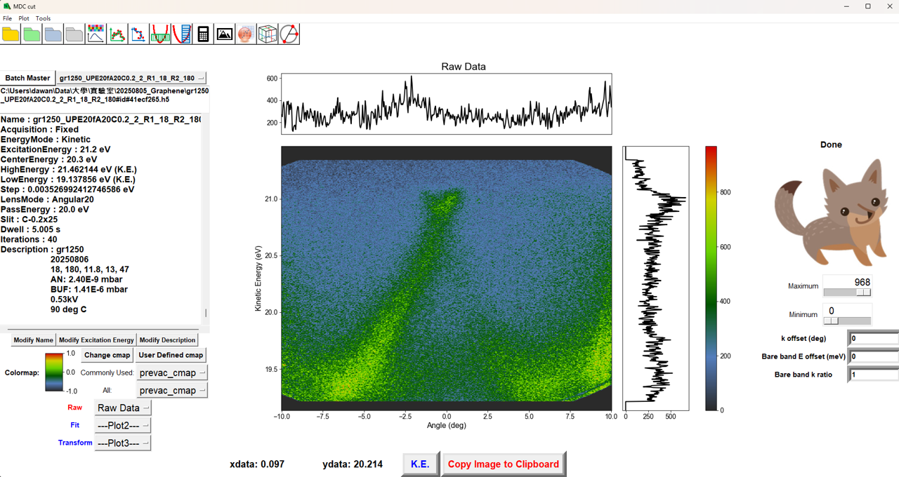
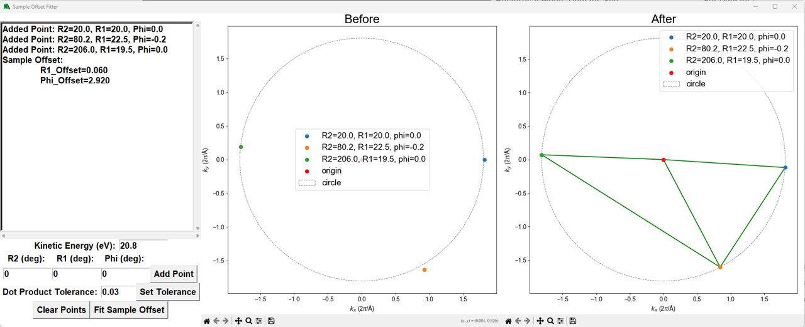
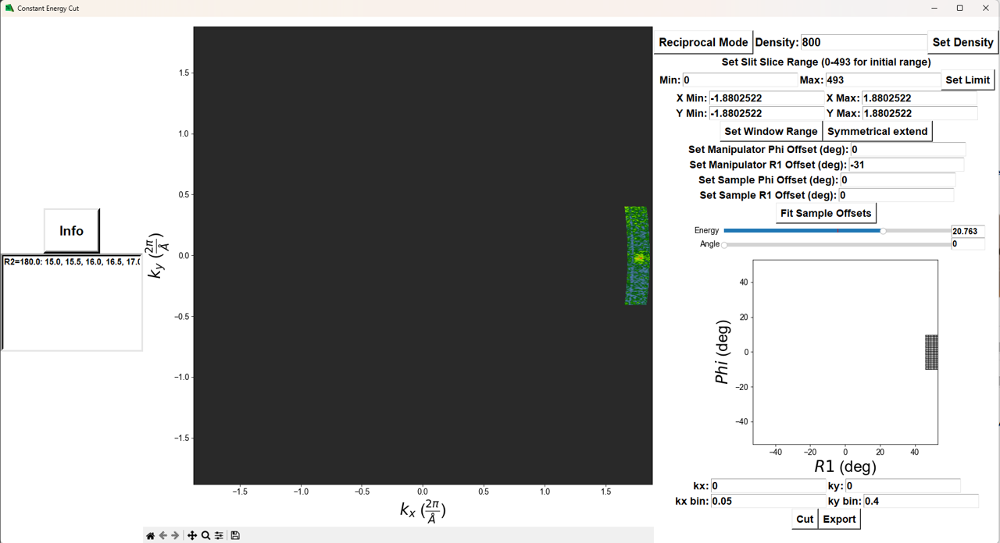
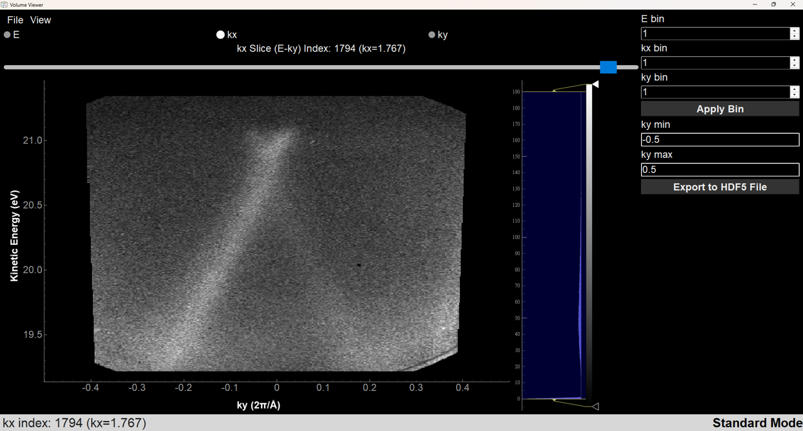
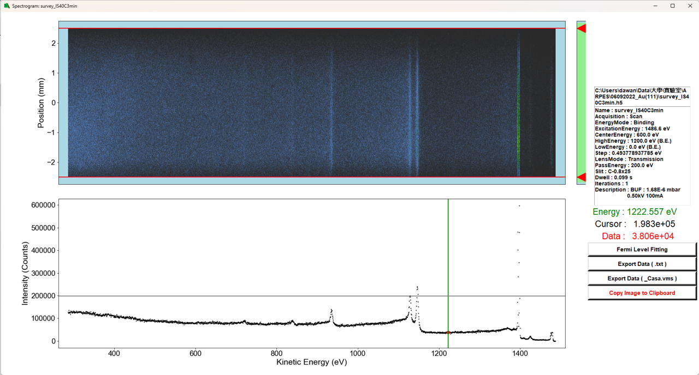
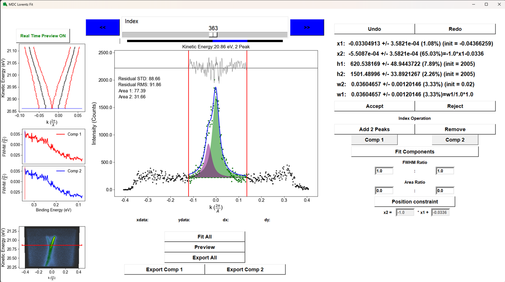

